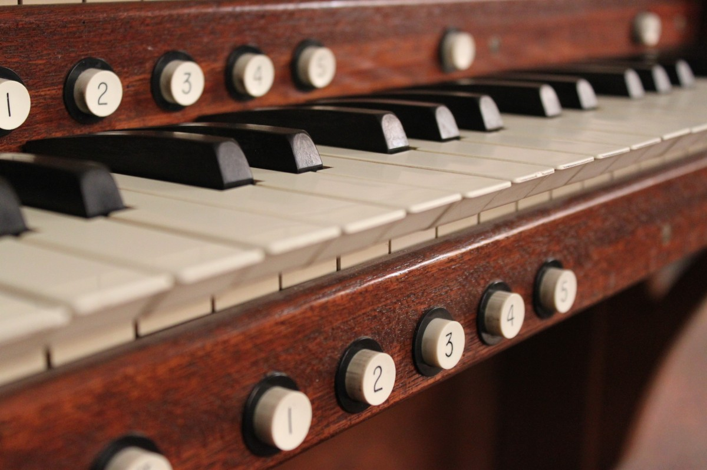

# St. Egbert Music Ministry

  

## Overview

This is a repository serving the music ministry at [St. Egbert's Catholic Church](https://www.stegbertcatholicchurch.org/) in Morehead City, NC. It provides the backend for the [public webpage](https://musicministry.github.io/stegbert) available at [https://musicministry.github.io/stegbert](https://musicministry.github.io/stebert). Please visit the [public webpage](https://musicministry.github.io/stegbert) for:

* Information about our ministry
* Downloadable weekly music lists
* Weekly "blog posts" containing the music list and videos
* Downloadable music schedules extending several weeks in advance to help with practice and preparation

## Disclaimer

This repository and the accompanying website are for general information purposes only. The website is intended to be a resource for St. Egbert parish musicians and may grow as needs evolve. Neither this repository nor the accompanying website are official communication of St. Egbert Catholic Church or the Catholic Diocese of Raleigh, North Carolina. All GitHub project code and resources are provided on an "as is" basis and the user assumes responsibility for its use.

---
