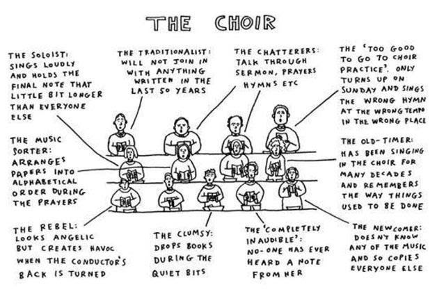

::: {.columns}
::: {.column width="70%"}

St. Egbert's prides itself on its vibrant music ministry that offers something for everyone. Music for weekend liturgies currently includes:

- **Saturday 5:00 [pm]{.smallcaps}:** cantor with guitar
- **Sunday 8:00 [am]{.smallcaps}:** cantor with organ or piano
- **Sunday 9:30 [am]{.smallcaps}:** Spanish Mass with Hispanic choir and band
- **Sunday 11:00 [am]{.smallcaps}:** cantor and choir with organ or piano

Do you like to sing or play an instrument? Do you appreciate good liturgical music and want to help grow St. Egbert’s music ministry into the best in the region? Do you want to double your prayer without doubling your words?

:::
::: {.column width="5%"}
:::
::: {.column width="25%"}

{fig-alt="QR code for sign up form" .lightbox}

:::
:::

 Opportunities for involvement are listed below. Interested in joining? Scan the QR code to [let us know your interest and contact info](https://docs.google.com/forms/d/11RL3KpFg7wW7Az953hjA0CmNK-pl8dILa3dnuBp3ocg/edit) or speak to Matt, our music coordinator.

::: {.red}
### Adult Choir
:::

The adult choir sings primarily at the 11 [am]{.smallcaps} Mass on Sundays. Rehearsals are Wednesdays 7:00-8:00 [pm]{.smallcaps} in the church from Labor Day through Pentecost.

Anyone 18 and older is welcome to join. The ability to read music is helpful but not required. Family of choir members are most welcome to join us in the choir area as well.

As we grow in numbers, we will begin (re-)introducting choir anthems and four-part harmony to further enhance our music and liturgies.

{fig-alt="Cartoon of choir members" fig-align="center" .lightbox}

::: {.red}
### Cantors
:::

Cantors lead the congregation in song at all liturgies. Any strong and confident singer (or anyone interested in becoming a strong and confident singer, which happens organically with practice) is welcome to become a cantor. Training will be provided. Cantor rehearsals take place on the first Tuesday of the month from 7:00-8:00 [pm]{.smallcaps} year-round in the church

::: {.red}
### Liturgical Ensemble
:::

The liturgical ensemble is composed of adults, high school, and capable middle school instrumentalists. The ensemble enhances the 11:00 [am]{.smallcaps} liturgy on special occasions throughout the year, generally once a month. These include, but are not limited to:

- Christmas (December)
- Confirmation (usually February)
- Last Sunday in Ordinary Time before Lent (February or early March)
- Easter (March or April)
- Pentecost (May or June)
- Solemnity of Christ the King (November)

String, brass, and woodwind instruments are welcome. Rehearsals are Tuesdays 7:00-8:00 [pm]{.smallcaps} in the church from Labor Day through Pentecost.

::: {.red}
### Accompanists
:::

Organists and/or pianists are needed to serve as substitute accompanists throughout the year, as well as for funerals and occasional weddings.

::: {.red}
### Singers and instrumentalists
:::

Aside from the rehearsed choir, anyone who enjoys singing is welcome to join us in the choir area at whatever Mass you attend to sing with us. Similarly, anyone interested in playing an instrument more regularly than the liturgical ensemble is also welcome to participate any weekend. Instrumentalists are asked to consult with the music director to coordinate getting music, either day-of or in advance.

